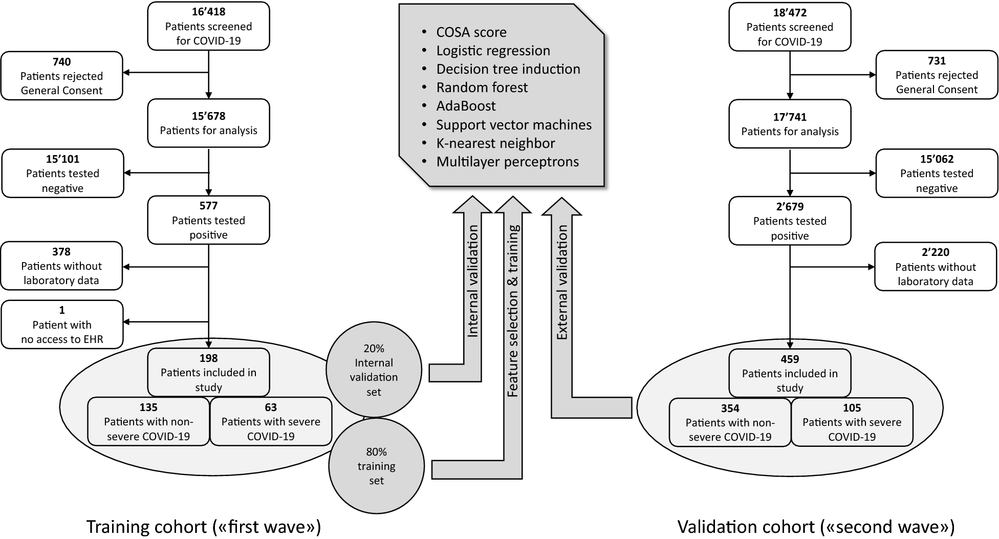
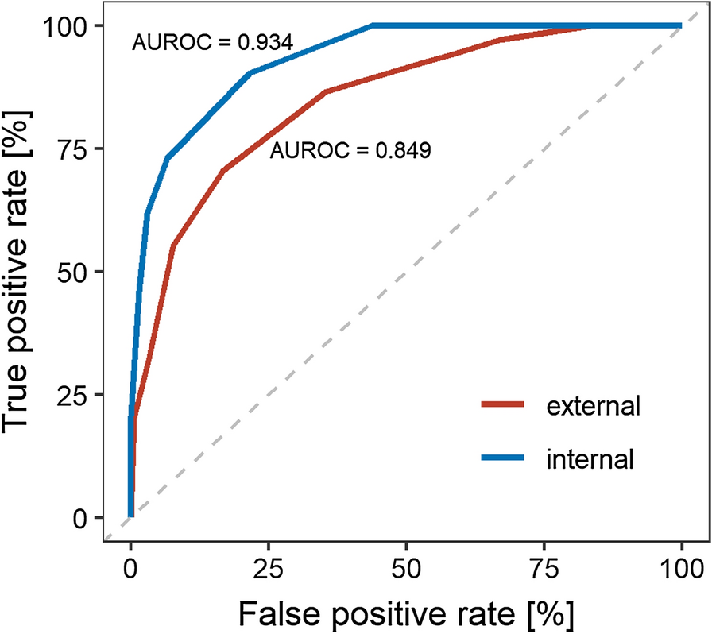

# Development and validation of a prognostic COVID-19 severity assessment (COSA) score and machine learning models for patient triage at a tertiary hospital

## Overview
This repo contains the data and model code for reproducing and implementing prognostic risk stratification tools for Covid-19 patients. The score was built on patient data from the [Insel Hospital Group, Bern, Switzerland](https://www.insel.ch) between February 1st and August 31st (‘first wave’, n=198) and September 1st through November 16th 2020 (‘second wave’, n=459). An online version of the score calculator is [available here](https://cptbern.github.io/cosa/).

Flowchart of training and validation cohort used for model and score development

## Models and performance
The *R* scripts cover a clinical risk stratification score and machine learning (ML) models developed using demographic data, medical history, and laboratory values taken up to 3 days before, or 1 day after, positive testing to predict severe outcomes of hospitalization (a composite endpoint of admission to intensive care, or death from any cause). Sex, C-reactive protein, sodium, hemoglobin, glomerular filtration rate, glucose, and leucocytes around the time of first positive testing (−3 to +1 days) were the most predictive parameters. AUROC of the risk stratification score on training data (AUROC=0.94, positive predictive value (PPV)=0.97, negative predictive value (NPV)=0.80) were comparable to the prospective validation cohort (AUROC=0.85, PPV=0.91, NPV=0.81). The most successful ML algorithm with respect to AUROC was support vector machines (median=0.96, interquartile range=0.85–0.99, PPV=0.90, NPV=0.58).

*Area under the receiver operating characteristic (AUROC) of the COVID-19 severity assessment (COSA) score. Training cohort (red, internal) and validation cohort (blue, external)*

## Reference to orginal article

*Schöning, V., C. et al. Development and validation of a prognostic COVID-19 severity assessment (COSA) score and machine learning models for patient triage at a tertiary hospital. J Transl Med 19, 56 (2021). doi.org/10.1186/s12967-021-02720-w*

[link to original publication (open access)](https://translational-medicine.biomedcentral.com/articles/10.1186/s12967-021-02720-w)
